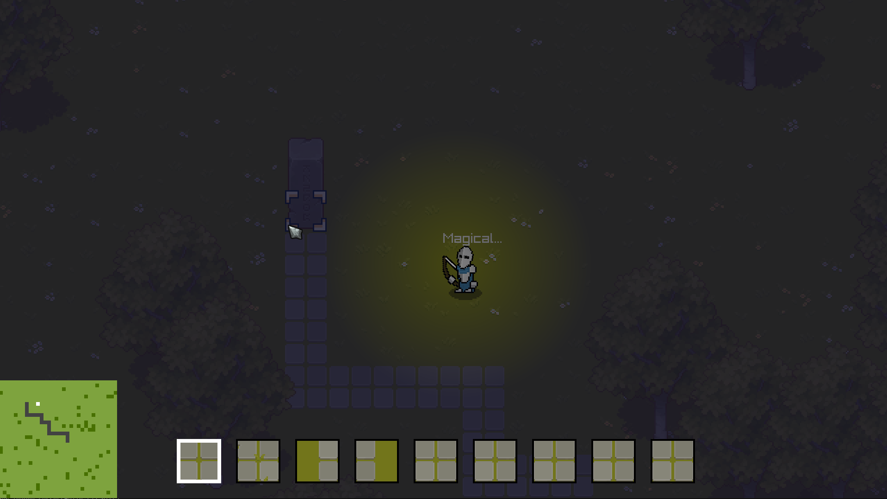
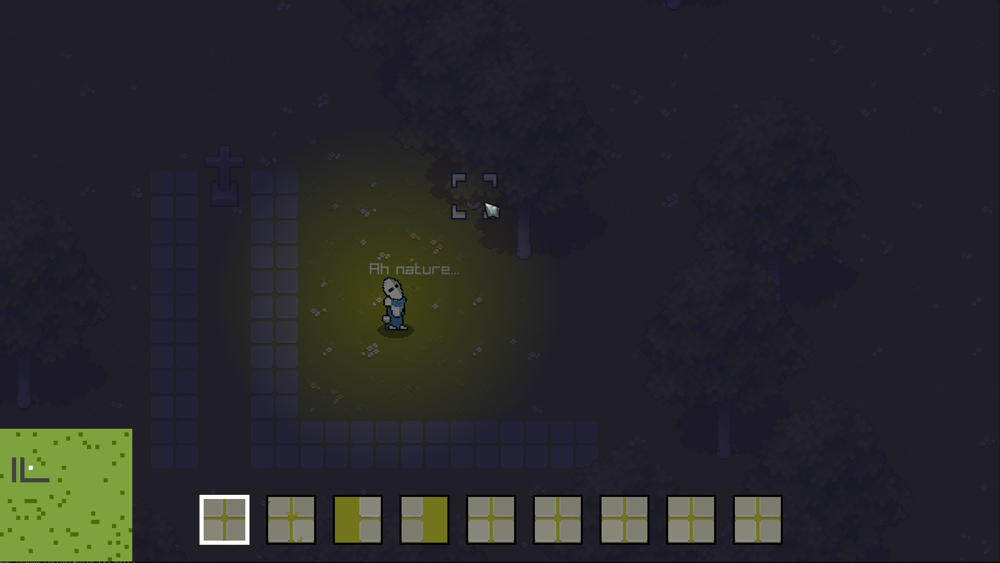

Game WIP.

Short side project to learn a little bit of C and GLSL using Raylib.

Code is a mess and no more progress planned.

Generates 32x32 world (randomisation of tiles/trees). Ability to place stone path tiles and grave stones/stone pillars.

